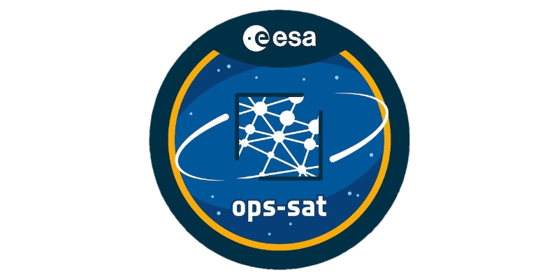
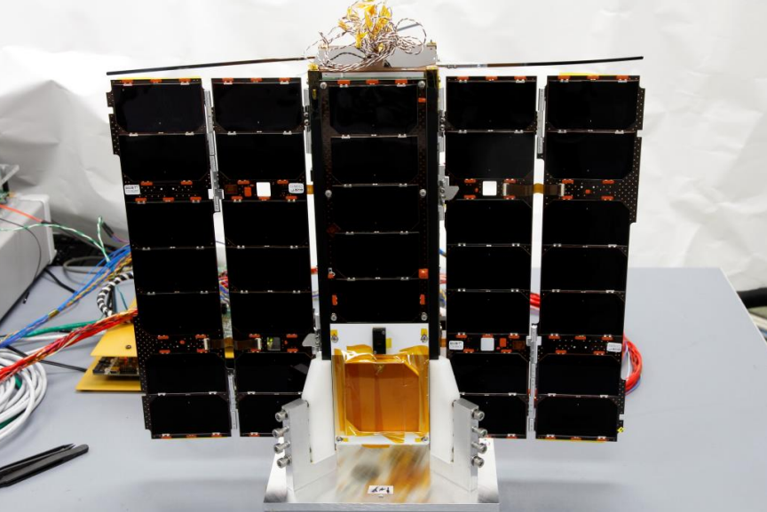
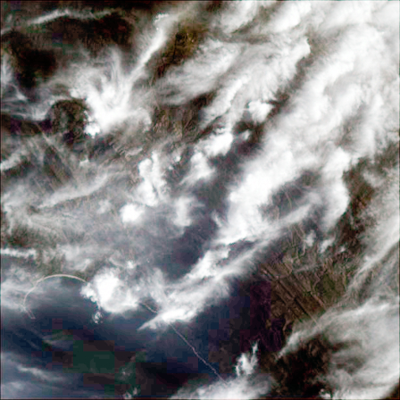
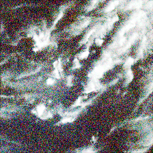
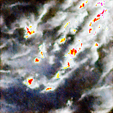
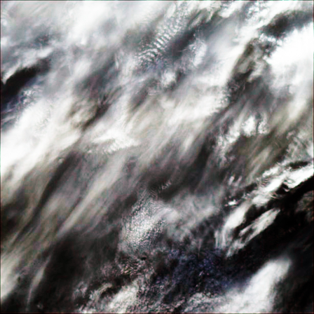
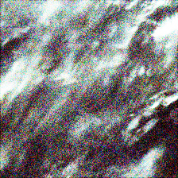
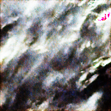

<p align="center">
  
</p>

# OPS-SAT Onboard Image Denoiser
This experiment uses Wasserstein GANs (WGANs) onboard the European Space Agency's OPS-SAT-1 spacecraft to reconstruct corrupted pictures of Earth thus showcasing **the very first use of Generative AI in space**.


## Background
The camera onboard the European Space Agency's OPS-SAT-1 spacecraft has been operating past its design life of 3 years [[1](https://digitalcommons.usu.edu/cgi/viewcontent.cgi?article=1159&context=smallsat)]. As the payload ages, there is an increasing risk of sensor degradation leading to corrupted images. This project evaluates Generative AI models derived from (WGANs)---an enhanced type of Generative Adversarial Networks---as a noise reduction solution to reconstruct such images. Autoencoders are also trained and evaluated for comparative purposes given their common use in noise reduction.

<p align="center">
  
</p>
  
**Figure 1: The OPS-SAT spacecraft in the clean room with deployed solar arrays (TU Graz).**

## Experiment
Images downlinked from the spacecraft serve as training data to which artificial fixed-pattern noise is applied to simulate sensor degradation. The trained neural networks are uplinked to the spacecraft's edge computer payload where they are processed by the onboard TensorFlow Lite interpreter to output noise-free images.

**On September 29, 2023, the OPS-SAT-1 mission achieved a significant milestone when it successfully captured, noised, and subsequently denoised two images using WGANs, marking the pioneering first application of Generative AI in space.**
 
## Results
The restored images have remarkably high structural similarity indices of 0.89 and 0.92---where 1 would indicate that they are identical to their original images. Interestingly, some reconstructed images are more confidently labeled by the onboard convolutional neural network image classifier when compared to their original counterparts. The counterintuitive observation challenges the conventional understanding that higher resolution always yields better results. This demonstrates that simplifying or modifying certain data features enhances the ability of some models to accurately interpret given inputs.

<div style="text-align:center;">
  <table align="center">
    <tr>
      <td></td>
      <td></td>
      <td></td>
    </tr>
    <tr>
      <td>(a) Original.</td>
      <td>(b) Noised.</td>
      <td>(c) Denoised.</td>
    </tr>
    <tr>
      <td></td>
      <td></td>
      <td></td>
    </tr>
    <tr>
      <td>(d) Original.</td>
      <td>(e) Noised.</td>
      <td>(f) Denoised.</td>
    </tr>
  </table>
</div>

**Figure 2: Fixed-Pattern Noise (FPN) factor 50 noising and WGANs Generative AI denoising onboard the spacecraft. Images are post-processed with color equalize.**

## Details
Links to our paper will be provided as soon as it's published. Meanwhile, enjoy browsing to the repository and reaching out via GitHub Issues!

### Citation
We appreciate citations to our upcoming peer-reviewed IEEE publication. Thank you!

#### BibTex
```BibTex
@inproceedings{ieee_aeroconf_labreche2024,
  title     = {{Generative AI... in Space! Adversarial Networks to Denoise Images Onboard the OPS-SAT-1 Spacecraft}},
  author    = {Labrèche, Georges and Guzman, Cesar and Bammens, Sam},
  booktitle = {{2024 IEEE Aerospace Conference}},
  year      = {2024}
}
```

#### APA
Labrèche, G., Guzman, C., & Bammens, S. (2024). Generative AI... in Space! Adversarial Networks to Denoise Images Onboard the OPS-SAT-1 Spacecraft. *2024 IEEE Aerospace Conference*.

## Past Experiments
The OPS-SAT-1 mission has achieved many firsts in onboard machine learning with neural networks. Past experiments have successfully executed TensorFlow Lite model interpreters on the spacecraft's edge computer payload [[2](https://ieeexplore.ieee.org/document/9843402), [3](https://www.researchgate.net/publication/363599665_Augmenting_Digital_Signal_Processing_with_Machine_Learning_techniques_using_the_Software_Defined_Radio_on_the_OPS-SAT_Space_Lab), [4](https://digitalcommons.usu.edu/smallsat/2022/all2022/65/)]. Onboard ML has since been a common practice by the spacecraft's mission control team, particularly for image-based autonomous decision-making. The experiment presented in this paper builds on those successes to train and evaluate onboard Generative AI.

Have any experiment idea? [Register to become an experimenter!](https://opssat1.esoc.esa.int/)


## Acknowledgements
The authors would like to thank the OPS-SAT-1 Mission Control Team at ESA's European Space Operations Centre (ESOC) for their continued support in validating the experiment, especially Vladimir Zelenevskiy, Rodrigo Laurinovics, [Marcin Jasiukowicz](https://yasiu.pl/), and Adrian Calleja. Their persistence in scheduling and running the experiment onboard the spacecraft until sufficient data was acquired and downlinked was crucial to the success of this experiment. A special thank you to [Kevin Cheng](https://kevkcheng.info/) from [Subspace Signal](https://subspacesignal.com/) for granting and facilitating remote access to the GPU computing infrastructure used to train the models presented in this work.

## References
[1] Segert T., Engelen S., Buhl M., & Monna B. (2011). [Development of the Pico Star Tracker ST-200 – Design Challenges and Road Ahead](https://digitalcommons.usu.edu/cgi/viewcontent.cgi?article=1159&context=smallsat). _25th Annual Small Satellite Conference_, Logan, UT, USA.

[2] Labrèche, G., Evans, D., Marszk, D., Mladenov, T., Shiradhonkar, V., Soto, T., & Zelenevskiy, V. (2022). [OPS-SAT Spacecraft Autonomy with TensorFlow Lite, Unsupervised Learning, and Online Machine Learning](https://ieeexplore.ieee.org/document/9843402). _2022 IEEE Aerospace Conference_, Big Sky, MT, USA,

[3] Mladenov T., Labrèche G., Syndercombe T., & Evans D. (2022). [Augmenting Digital Signal Processing with Machine Learning techniques using the Software Defined Radio on the OPS-SAT Space Lab](https://www.researchgate.net/publication/363599665_Augmenting_Digital_Signal_Processing_with_Machine_Learning_techniques_using_the_Software_Defined_Radio_on_the_OPS-SAT_Space_Lab). _73rd International Astronautical Congress_, Paris, France.

[4] Kacker S., Meredith A., Cahoy K., & Labrèche G. (2022). [Machine Learning Image Processing Algorithms Onboard OPS-SAT](https://digitalcommons.usu.edu/smallsat/2022/all2022/65/). _36th Annual Small Satellite Conference_, Logan, UT, USA.

## About the experimenters
<p align="center">
  
</p>

### Georges Labrèche
[Georges](https://georges.fyi) enjoys running marathons and running experiments on the OPS-SAT-1 Space Lab. Through his work, he has established himself as a leading figure in applied artificial intelligence for in-orbit machine learning in onboard spacecraft autonomy. He lives in Queens, NY, and supports the OPS-SAT-1 mission through his Estonian-based consultancy [Tanagra Space](https://tanagraspace.com/). Georges received his B.S. in Software Engineering from the University of Ottawa, Canada, M.A. in International Affairs from the New School University in New York, NY, and M.S. in Spacecraft Design from Luleå University of Technology in Kiruna, Sweden.

### César Guzman
César is an interdisciplinary R&D engineer with a background in reactive planning, plan execution and monitoring, space systems engineering, and machine learning. Cesar holds a Ph.D. in AI at the University Politechnical of Valencia. He enjoys developing machine learning experiments on the OPS-SAT-1 Space Lab. In 2012, He collaborated with NASA Ames Research Center and is partner at the Estonian-based consultancy [Tanagra Space](https://tanagraspace.com/).

### Sam Bammens
A distinguished graduate with an M.S. degree in electronics and computer engineering technology from Hasselt University and KU Leuven in 2021, has a compelling background. He embarked on his career journey with ESA. During his initial two years, Sam served as a Young Graduate Trainee on the mission control team of OPS-SAT, showcasing his expertise. Presently, he holds the role of Spacecraft Operations Engineer within ESA's ESOC interplanetary department. He's a vital part of the flight control team dedicated to ESA's Solar Orbiter mission, solidifying his presence in the realm of space exploration.

<br/>
<p align="center">
  
</p>
