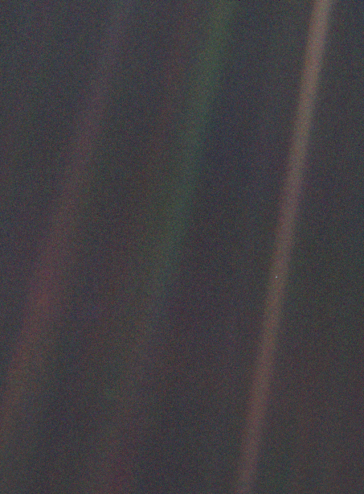
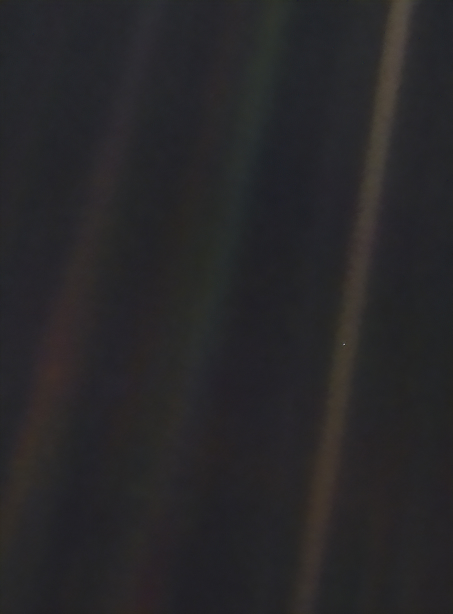

### From Voyager to OPS-SAT: The Evolution of a Space Photography Icon

- **February 14, 1990**: Voyager 1 captures the [Pale Blue Dot](https://en.wikipedia.org/wiki/Pale_Blue_Dot), a breathtaking view of Earth from a staggering 6 billion kilometers away. A profound reminder of our place in the universe.
- **November 21, 2023**: The Pale Blue Dot is sent back to space to be enhanced by OPS-SAT-1's onboard Generative AI. It is downlinked back to Earth as the Denoised Blue Dot (this time around from approximately 440 kilometers away).

  <table align="center">
    <tr>
      <td></td>
      <td></td>
    </tr>
    <tr>
      <td>(a) The Pale Blue Dot.</td>
      <td>(b) The Denoised Blue Dot.</td>
    </tr>
  </table>

