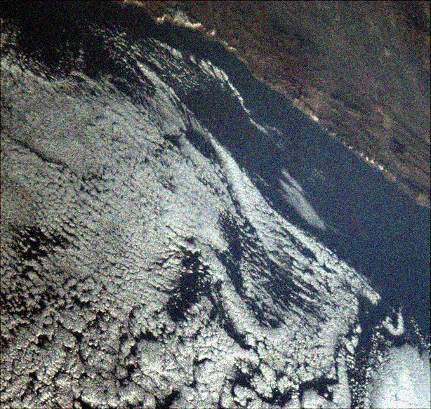
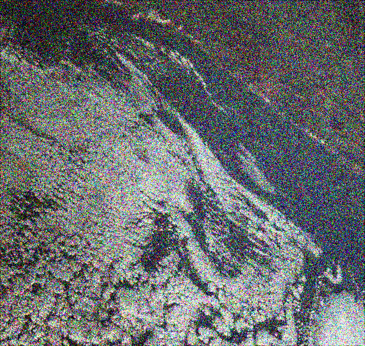
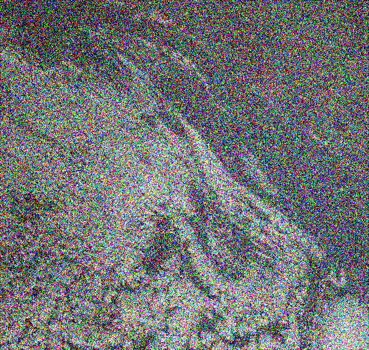
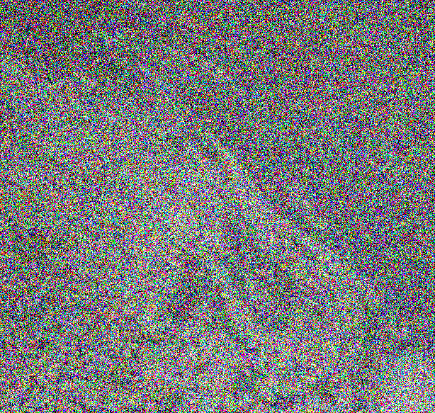
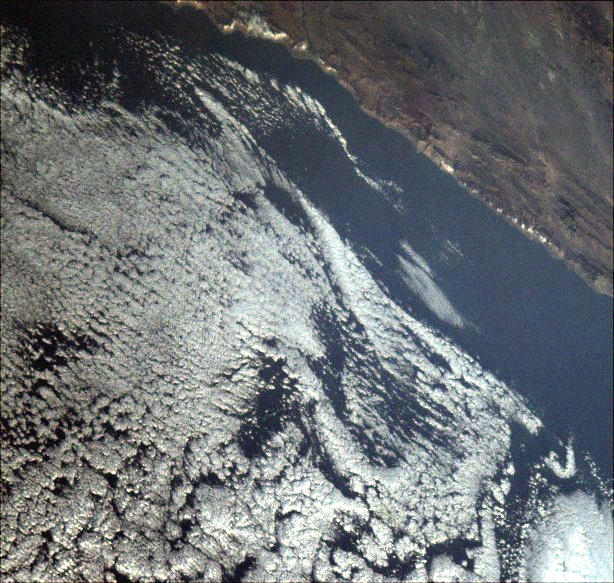
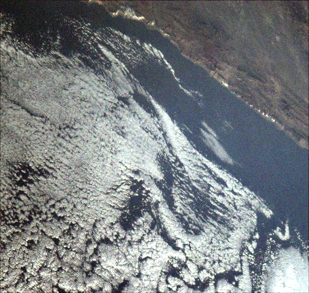
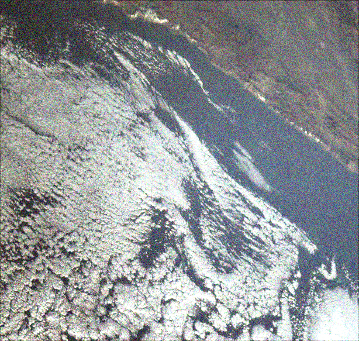
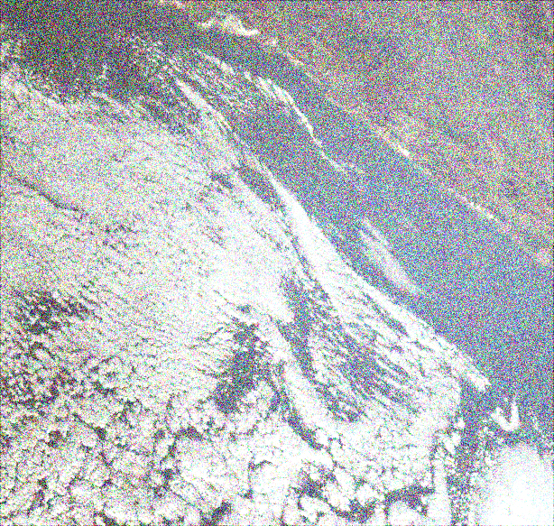
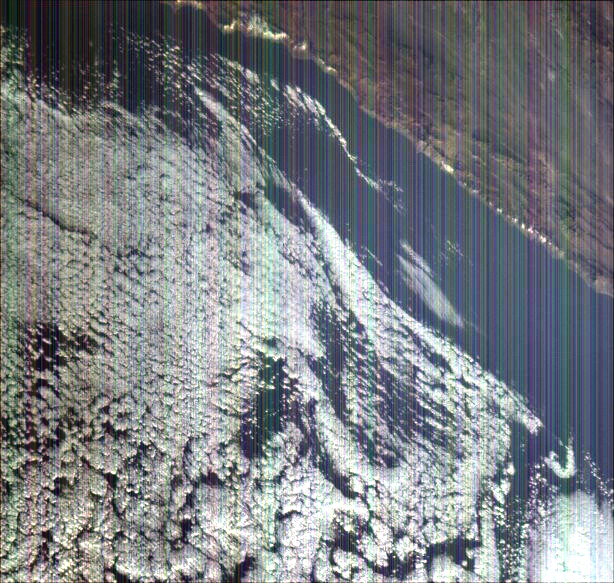
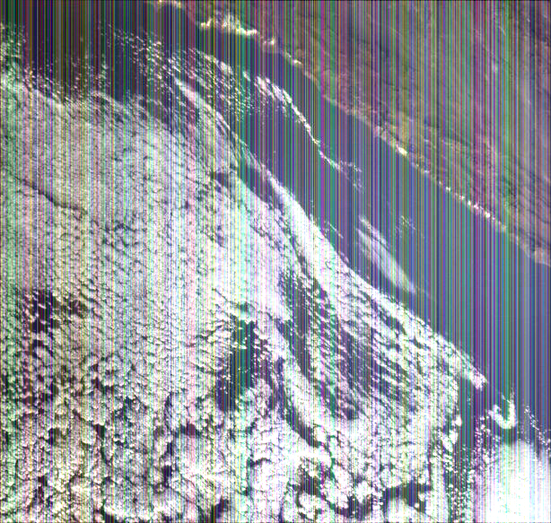

# Noiser
- Add noise to an image, either a fixed noise pattern (FPN) or a Gaussian distribution.
- Uses the [stb library](https://github.com/georgeslabreche/stb) to read the image input and write the noisy image output.
- The input and output image format is in jpeg.

## Sensor Degradation
Use FPN to simulate sensor degradation for Charge-Coupled Device (CCD) as well as Complementary Metal Oxide Semiconductor (CMOS).

### Charge-Coupled Device (CCD)
The FPN can simulate some types of damage or defects that may occur in CCD sensors or other image sensors. These defects often manifest as stuck or dead pixels, where a particular pixel (or a group of pixels) consistently reads high (hot pixel) or low (dead pixel) regardless of the actual light hitting the sensor. These defects can lead to a pattern of noise that remains consistent across different images.

### Complementary Metal Oxide Semiconductor (CMOS)
Similar to CCD sensors, CMOS sensors can also have stuck or dead pixels, which can lead to FPN across different images. However, CMOS sensors have some unique characteristics that may result in additional sources of FPN. For example, each pixel in a CMOS sensor has its own amplifier, and slight variations in these amplifiers can cause variations in pixel responses, leading to FPN. This is sometimes referred to as _column FPN_, as it often appears as vertical stripes in the image.
## Samples
Sample outputs with doubling Gaussian noise factors (NF) from 25 to 400:

<table>
  <tr>
    <td> Original</td>
    <td> NF 25</td>
    <td> NF 50</td>
  </tr>
  <tr>
    <td> NF 100</td>
    <td> NF 200</td>
    <td> NF 400</td>
  </tr>
</table>

Sample outputs with doubling FPN:

<table>
  <tr>
    <td> Original</td>
    <td> NF 25</td>
    <td> NF 50</td>
  </tr>
  <tr>
    <td> NF 100</td>
    <td> NF 200</td>
    <td> NF 400</td>
  </tr>
</table>

Sample outputs with column FPN:
<table>
  <tr>
    <td> Original</td>
    <td> NF 50</td>
    <td> NF 100</td>
  </tr>
</table>

**Why does the same noise factor value results in more noise for Gaussian distributions compared to FPN?**

When generating _FPN_ with a uniform distribution, all values within the specified range hold equal probability of being chosen. The resultant noise values added to each pixel will fall within the boundaries dictated by the noise factor, with all values being equally probable.

In contrast, generating _Gaussian noise_ produces values following a Gaussian or normal distribution. This distribution exhibits a bell curve shape, where values near the mean (set to 0 in the provided code) hold a higher likelihood of occurrence than values further away. In this case, the noise factor represents the standard deviation of the distribution. An increased noise factor enhances the spread of the distribution, leading to a broader range of noise values generated.

Consequently, a specific noise factor may result in more visible noise in the case of Gaussian noise generation as compared to FPN. Although the range of noise values is technically equivalent for both, Gaussian noise generation is more prone to generating values that differ significantly from 0 (the mean), which results in more noticeable noise.

